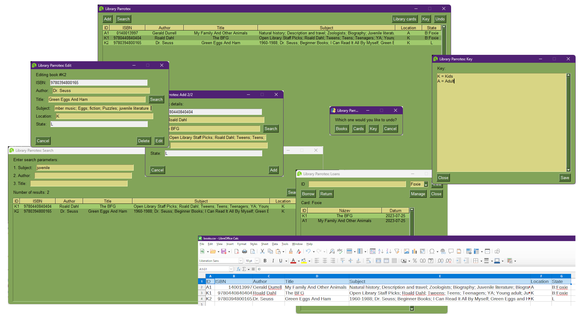

## ***Deprecated since 06/30/2024, when PySimpleGUI, the library this project depended on, has shifted to an (at least for me) unusable commercial project.***

# Library Parrotex

*A simple library index and card software.*

[Česká Verze](https://github.com/FTEdianiaK/library-parrotex/blob/main/READMEcs.md) | [Changelog](https://github.com/FTEdianiaK/library-parrotex/blob/main/CHANGELOG.md) | [Full Changelog](https://github.com/FTEdianiaK/library-parrotex/compare/v2.2...v2.2.1) | [License](https://github.com/FTEdianiaK/library-parrotex/blob/main/LICENSE)

### Features
- Grid view showing all the important book details that can be sorted by each.
- Window for searching and filtering through the books by title, author or subject.
- Books are saved in a file that's compatible with most spreadsheet editors (.csv).
- Helpful add window which can look info up by ISBN or redirect you to the book's OpenLibrary records by title.
- Edit function using the same window as the add one.
- Library card system that lists all the borrowed books of each card recorded along with the date when they were borrowed.
- Simple undo of last change for when you make a mistake.
- Key file that can be used to write down some notes, e.g. what does each location abbreviation mean.

### How to...
**Install:**
- **Windows:** Download the .exe installer, run it and choose a folder where to install the software. After the install has finished, run "enLibraryParrotex.exe".
- **Source code:** Download "enLibaryParrotex.py" and put it into an empty folder (when updating replace older version). Afterwards run the file.

**Update:**
- To update follow the same instructions as for installation.
- It's recommended to back up the data files (books.csv, cards.json, ids.json, help.txt) before updating, afterwards place them in the same folder as the main file.
- You only need to update when the newest version is different from the one you're using (you can check that at the splash screen).
- **BEWARE!** If the first number in the newest version (1 for 1.4) isn't the same as the one you're using, it's possible that your data files will have to be updated as well. Check the changelog for more info on that.

**Remove:** Use "unins000.exe" (if you used the .exe installer), afterwards delete the folder it's been installed in to delete the data files left behind by the software as well (books.csv, cards.json, ids.json, help.txt) unless you plan on keeping them.

### Known Bugs
- None yet... Report them [here](https://github.com/FTEdianiaK/library-parrotex/issues).

### Credits
[Parrot icon by Lorc from game-icons.net](https://game-icons.net/1x1/lorc/parrot-head.html)

**Libraries used in the code:**
- [operator, webbrowser, csv, datetime, json, re, time, math - from Python Standard Library - PSF](https://docs.python.org/3/library/index.html)
- [isbnlib - by Alexandre Lima Conde - LGPLv3](https://pypi.org/project/isbnlib/)
- [PySimpleGui - by PySimpleGui - LGPLv3+](https://pypi.org/project/PySimpleGUI/)
- [requests - by Kenneth Reitz - Apache 2.0](https://pypi.org/project/requests/)

**Other used libraries:**
- [pyinstaller - by Hartmut Goebel, Giovanni Bajo, David Vierra, David Cortesi, Martin Zibricky - GPLv2](https://pypi.org/project/pyinstaller/)
- [pycodestyle - by Johann C. Rocholl - MIT](https://pypi.org/project/pycodestyle/)
